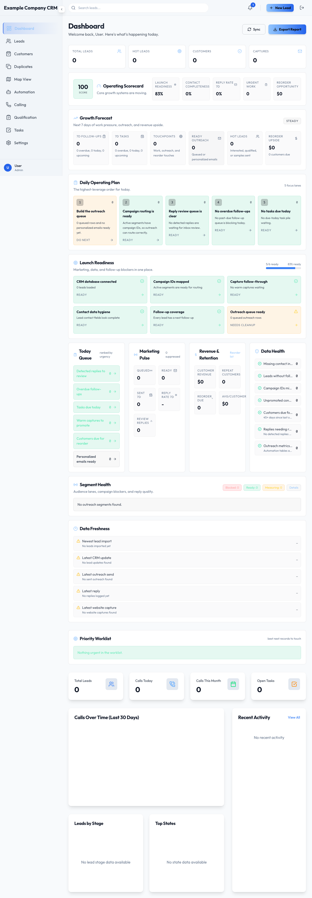
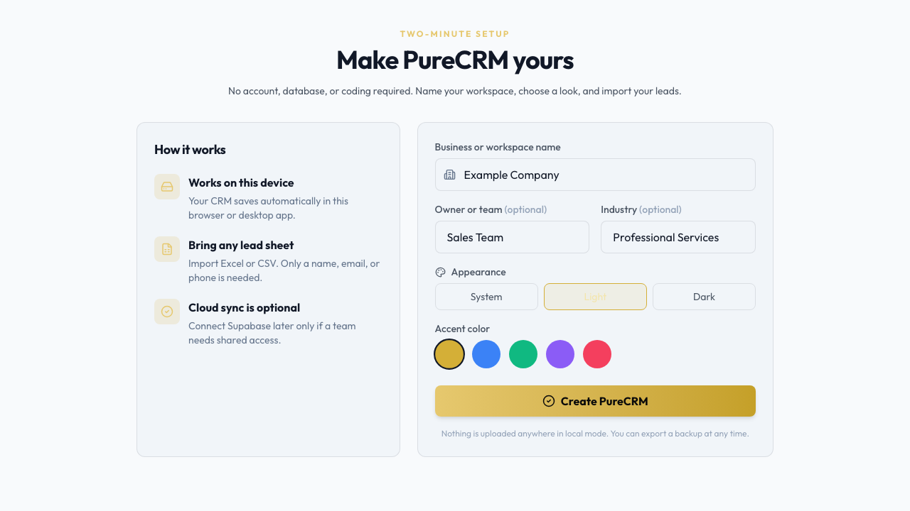
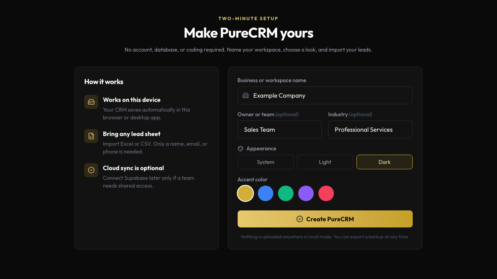

<p align="center">
  
</p>

<h1 align="center">PureCRM</h1>

<p align="center">
  A local-first desktop CRM that works without an account, database, or server.
</p>

<p align="center">
  <a href="https://github.com/zyperize/PureCRM/releases/latest"></a>
  <a href="https://github.com/zyperize/PureCRM/actions/workflows/ci.yml"></a>
  
  
</p>

## Download

| Platform | Download | Notes |
| --- | --- | --- |
| Windows 10/11 | [Download the `.exe` installer](https://github.com/zyperize/PureCRM/releases/latest) | x64 installer |
| macOS 11+ | [Download the universal `.dmg`](https://github.com/zyperize/PureCRM/releases/latest) | Apple Silicon and Intel |

PureCRM stores your workspace locally on your device by default. No Supabase
project, login, or technical setup is required.



## Start in two minutes

1. Install and open PureCRM.
2. Name your workspace and choose a theme.
3. Import an Excel (`.xlsx`) or CSV lead sheet.

A lead needs only a company/contact name, email, or phone number. PureCRM
recognizes common spreadsheet headings automatically.

<p>
  
  
</p>

## Features

- Lead and customer records, pipeline stages, notes, tags, and follow-ups
- Excel/CSV import, CSV export, duplicate cleanup, maps, and reports
- Tasks, calendar, qualification questions, calling scripts, and call logging
- Separate outreach workspace for email campaigns and reply review
- Light, dark, and system appearance with five accent colors
- Local JSON backup, restore, and safe reset
- Optional Supabase Team sync for shared multi-user data
- Optional Gemini-assisted call transcription

## Privacy by default

Local workspaces use IndexedDB and remain on the computer running PureCRM.
Nothing is uploaded unless the user explicitly configures an optional external
service. See [Privacy](docs/PRIVACY.md) and [Security](SECURITY.md).

## Development

Requirements: Node.js 20+, npm, and—only for native desktop builds—the Rust
toolchain required by [Tauri 2](https://v2.tauri.app/start/prerequisites/).

```bash
git clone https://github.com/zyperize/PureCRM.git
cd PureCRM/crm-app
npm ci
npm run dev
```

No `.env` file is required for local mode.

```bash
npm run verify       # lint + production build
npm run test:setup   # local-first browser regression
npm run desktop:dev  # native desktop development
```

## Documentation

- [Getting started](crm-app/GETTING-STARTED.md)
- [Excel and CSV import](crm-app/CSV-IMPORT-GUIDE.md)
- [Desktop builds and distribution](crm-app/DESKTOP.md)
- [Optional Team sync](crm-app/TEAM-SYNC.md)
- [Optional email automation integration](crm-app/AUTOMATION-INTEGRATION.md)
- [Architecture](docs/ARCHITECTURE.md)
- [Contributing](CONTRIBUTING.md)
- [Changelog](CHANGELOG.md)

## Repository layout

```text
crm-app/              React, Vite, and Tauri application
crm-app/src/          UI and local/cloud data services
crm-app/src-tauri/    Native Windows and macOS shell
crm-app/e2e/          Playwright regression tests
docs/                 Product and architecture documentation
.github/              CI, releases, and contribution templates
```

## License

PureCRM is source-available for evaluation and portfolio demonstration. It is
not open-source software and may not be redistributed or resold without written
permission. See [LICENSE](LICENSE).
